# JavaWeb

## 1. 基本概念

## 2. web服务器

### 2.1 主要技术

### 2.2 web服务器介绍

服务器是一种被动的操作，用来处理用户的一些请求和响应信息。


**IIS**

- 微软的
- ASP...，在Windows中自带

**Tomcat（重点）**

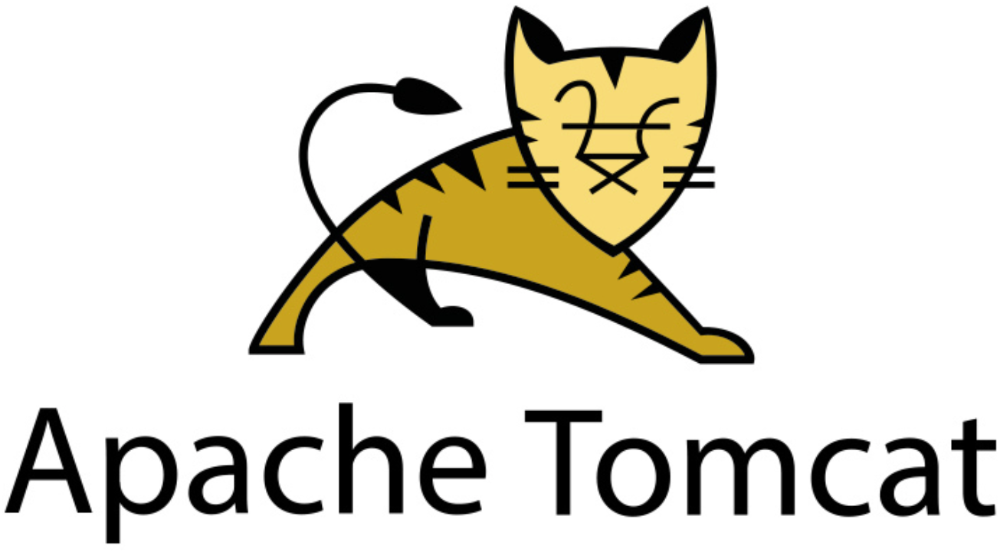

Tomcat是[Apache](https://baike.baidu.com/item/Apache/6265?fromModule=lemma_inlink) 软件基金会（Apache Software Foundation）的[Jakarta](https://baike.baidu.com/item/Jakarta/15952232?fromModule=lemma_inlink) 项目中的一个核心项目，最新的Servlet 和[JSP](https://baike.baidu.com/item/JSP/141543?fromModule=lemma_inlink) 规范总是能在Tomcat 中得到体现，Tomcat 5支持最新的Servlet 2.4 和JSP 2.0 规范。因为Tomcat 技术先进、性能稳定，而且免费，因而深受[Java](https://baike.baidu.com/item/Java/85979?fromModule=lemma_inlink) 爱好者的喜爱并得到了部分软件开发商的认可，成为比较流行的Web [应用服务器](https://baike.baidu.com/item/应用服务器/4971773?fromModule=lemma_inlink)。

Tomcat 服务器是一个免费的[开放源代码](https://baike.baidu.com/item/开放源代码/114160?fromModule=lemma_inlink)的[Web](https://baike.baidu.com/item/Web/150564?fromModule=lemma_inlink) 应用服务器，属于轻量级应用服务器，在中小型系统和并发访问用户不是很多的场合下被普遍使用，是开发和调试JSP 程序的首选。对于一个初学者来说，Tomcat是最佳选择。

Tomcat最新版本为10.0.23。

**工作3~5年后，可以尝试手写Tomcat服务器。**

## 3. Tomcat

### 3.1 下载安装

Tomcat官网：https://tomcat.apache.org/

### 3.2 Tomcat启动和配置

- 目录结构

  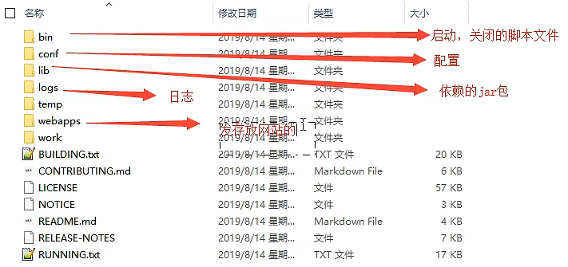

- 启动和关闭

  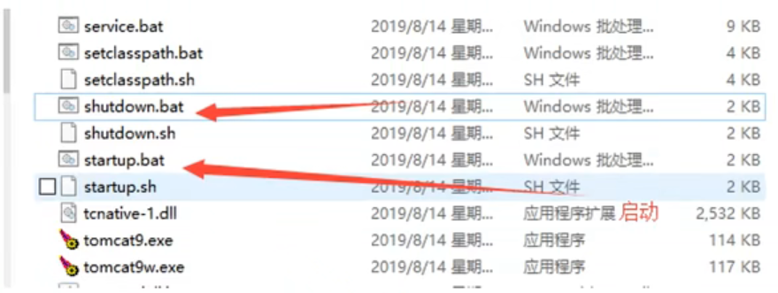

- 访问测试：http://localhost:8080

- 在`conf/server.xml`中可以配置：

  - 启动端口号

    ```xml
    <Connector port="8080" protocol="HTTP/1.1"
                connectionTimeout="20000"
                redirectPort="8443"
                maxParameterCount="1000"
                />
    ```

    |  服务  | 默认端口号 |
    | :----: | :--------: |
    | Tomcat |    8080    |
    | MySQL  |    3306    |
    |  http  |     80     |
    | https  |    443     |

  - 主机名称

    - 默认主机名为：localhost  = 127.0.0.1
    - 默认网站应用存放位置为：webapps

    ```xml
     <Host name="localhost"  appBase="webapps"
           unpackWARs="true" autoDeploy="true">
    ```

    

### 3.4 发布一个web网站

`不会就先模仿`：将自己写的网站，放到服务器（Tomcat）中指定的web应用文件夹（webapps）下，就可以实现访问

- 网站的结构

  ```java
  -- webapps : Tomcat服务器的web目录
      -ROOT 默认进来的页面
      -sun1f : 自己网站的文件夹名
          - WEB-INF ： 存放程序
          	- classes ： java程序
          	- lib : web应用所依赖的jar包
          	- web.xml : 网站的配置文件
          - index.html : 默认的首页
          - static
              - css
              	- style.css
              - javascript
              - img
          - ...
  ```

  

## 4. Http

### 4.1 基本概念

> HTTP（超文本传输协议）是一个简单的请求-响应协议，它运行在TCP之上

- 文本：html、字符串、...

- 超文本：图片、音乐、视频、定位、地图、...

- 端口号：80

- https：s 代表安全的，端口号443
- 两个时代
  - http1.0，客户端与web服务器连接后，只能获得一个web资源，之后断开连接
  - http1.1，客户端与web服务器连接后，可以获得多个web资源

### 4.2 Http请求

> 客户端发请求（Request）到服务器

以百度为例：

```txt
# 通用部分
Request URL:https://www.baidu.com/                       # 请求地址
Request Method:GET                                       # 有get方法和post方法
Status Code:200 OK                                       # 状态码：200
Remote Address:[240e:83:205:5a:0:ff:b05f:346b]:443       # 远程地址
```

请求行中的请求方式：

- GET：请求能够携带的参数较少，大小有限制，会在浏览器的URL地址栏显示数据内容，不安全，但高效
- POST：请求能够携带的参数没有限制，大小没有限制，不会在浏览器的URL地址栏显示数据内容，安全，但不高效

```txt
# 请求标头
Accept:text/html
Accept-Encoding:gzip, deflate, br
Accept-Language:zh-CN,zh;q=0.9,en;q=0.8,en-GB;q=0.7,en-US;q=0.6,zh-TW;q=0.5
Cache-Control:max-age=0
Connection:keep-alive
```

### 4.3 Http响应

> 服务端返回响应（Response）给客户端

以百度为例：

```txt
Connection:keep-alive                         # 保持连接，使用了http1.1
Content-Encoding:gzip                         # 编码
Content-Type:text/html; charset=utf-8         # 类型
```

- 响应体

  ```txt
  # 请求标头
  Accept:                 # 告诉浏览器，它所支持的数据类型
  Accept-Encoding:        # 支持那种编码格式 GBK UTF-8 GB2312 ISO8859-1
  Accept-Language:        # 告诉浏览器，它的语言环境
  Cache-Control:          # 缓存控制
  Connection:				# 告诉浏览器，请求完成是断开还是保持连接
  HOST:					# 主机
  Refresh:                # 告诉客户端，多久刷新一次
  Location:               # 让网页重新定位
  ```

- ==响应状态码==

  - 200：请求响应成功
  - 3**：请求重定向
  - 4**：找不到资源，如404
  - 5**：服务器代码错误，如500、502（网关错误）

## 5. Maven

有什么用

- 在Javaweb开发中，使用Maven可以自动导入和配置所需要的大量jar包。

核心思想

- ==约定大于配置==，Maven会规定好我们该如何去编写Java代码，必须要按照这个规范来

### 5.1 下载安装

官网：https://maven.apache.org/

### 5.2 配置环境变量

- 在系统环境变量中增加如下参数：
  - M2_HOME：Maven目录下的bin目录
  - MAVEN_HOME：Maven目录
- 在系统PATH中添加配置：%MAVEN_HOME%\bin

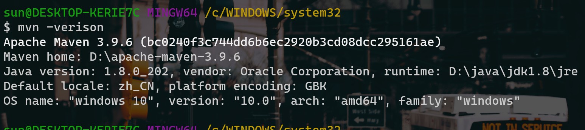

通过mvn -version测试配置成功

### 5.3 阿里云镜像

国内建议使用阿里云镜像，可以加速下载，在`conf/settings.xml`中添加：

```xml
<mirror>
	<id>alimaven</id>
	<name>aliyun maven</name>
	<url>http://maven.aliyun.com/nexus/content/groups/public/</url>
	<mirrorOf>central</mirrorOf>
</mirror>
```

### 5.4 本地仓库

建立一个本地仓库：localRepository，在`conf/settings.xml`中添加：

```xml
<localRepository>D:\apache-maven-3.9.6\maven-repo</localRepository>
```

### 5.5 在IDEA中使用Maven

 见视频[javaweb-06：IDEA中Maven的操作](https://www.bilibili.com/video/BV12J411M7Sj/?p=6&share_source=copy_web&vd_source=6246bcda2eaa71d8224569698319fbc3)

## 6. Servlet

### 6.1 Servlet简介

- Servlet是sun公司开发动态web的一门技术
- sun在这些api中提供一个接口叫做Servlet，如果想开发一个Servlet程序，只需要完成两个小步骤：
  - 编写一个类，实现Servlet接口
  - 把开发好的Java类部署到web服务器中

**把实现了Servlet接口的Java程序叫做Servlet**

### 6.2 HelloServlet

Servlet接口sun公司有两个默认的实现类：HttpServlet和GenericServlet

步骤：

- 构建一个普通的Maven项目，删掉里面的src目录，以后我们的学习就在这个项目里面建立Module，这个空的工程就是Maven主工程。

- 关于Maven父子工程的理解：

  - 父项目中会有

    ```xml
    <modules>
    	<module>servlet-01</module>
    </modules>
    ```

  - 子项目中会有

    ```xml
    <parent>
    	<groupId>com.sun1f</groupId>
    	<artifactId>javaweb-02-servlet</artifactId>
    	<version>1.0-SNAPSHOT</version>
    </parent>
    ```

  父项目中的java包子项目可以直接使用

- Maven环境优化：

  - 修改web.xml为最新的
  - 将Maven的结构搭建完整

- 编写一个Servlet程序

  - 编写一个普通类

  - 实现Servlet接口，这里我们直接继承HttpServlet

    ```java
    public class HelloServlet extends HttpServlet {
        @Override
        protected void doGet(HttpServletRequest req, HttpServletResponse resp) throws ServletException, IOException {
            PrintWriter writer = resp.getWriter();
            writer.print("Hello Servlet");
        }
    
        @Override
        protected void doPost(HttpServletRequest req, HttpServletResponse resp) throws ServletException, IOException {
            super.doPost(req, resp);
        }
    }
    ```

- 编写Servlet的映射

  **我们写的是Java程序，但是要通过浏览器访问，而浏览器需要连接web服务器，所以我们需要在web服务中注册我们写的Servlet，还需给它一个浏览器能够访问的路径**

  ```xml
  <!--注册Servlet-->
  <servlet>
      <servlet-name>hello</servlet-name>
      <servlet-class>com.sun1f.servlet.HelloServlet</servlet-class>
  </servlet>
  <!--Servlet的请求路径-->
  <servlet-mapping>
      <servlet-name>hello</servlet-name>
      <url-pattern>/hello</url-pattern>
  </servlet-mapping>
  ```

- 配置Tomcat

- 启动测试

### 6.3 Servlet原理

Servlet由web服务器调用，web服务器在收到浏览器的请求之后，会

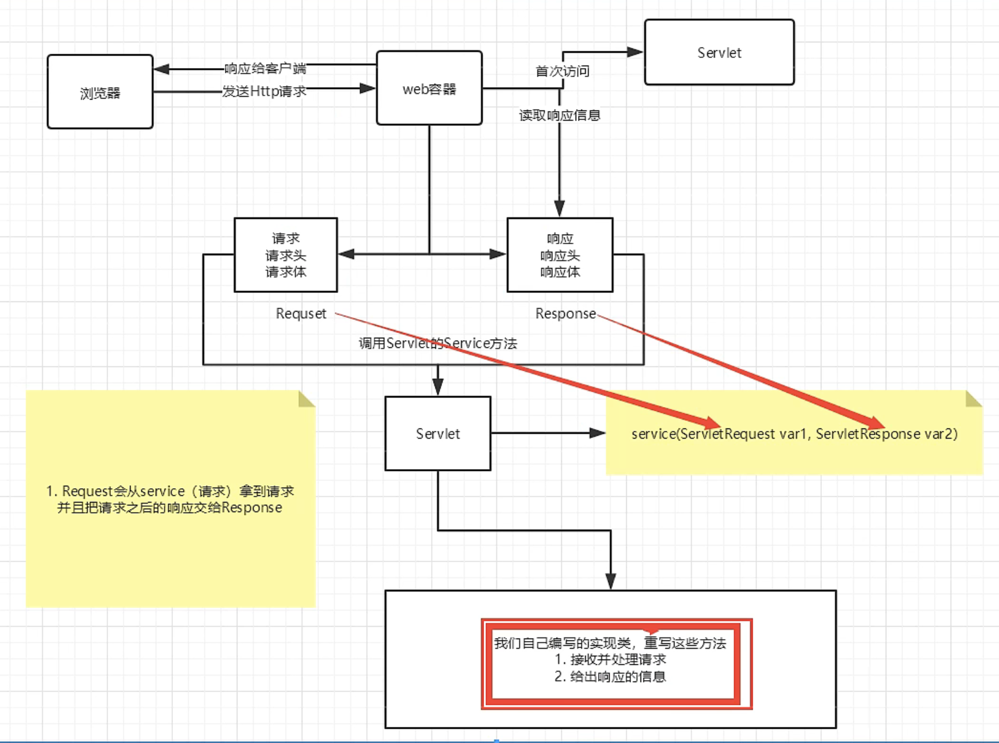

### 6.4 Mapping问题

1. 一个Servlet可以指定一个映射路径

   ```xml
   <!--最普通情况-->
   <servlet-mapping>
       <servlet-name>hello</servlet-name>
       <url-pattern>/hello</url-pattern>
   </servlet-mapping>
   ```

2. 一个Servlet可以指定多个映射路径

   ```xml
   <servlet-mapping>
       <servlet-name>hello</servlet-name>
       <url-pattern>/hello1</url-pattern>
   </servlet-mapping>
   <servlet-mapping>
       <servlet-name>hello</servlet-name>
       <url-pattern>/hello2</url-pattern>
   </servlet-mapping>
   <servlet-mapping>
       <servlet-name>hello</servlet-name>
       <url-pattern>/hello3</url-pattern>
   </servlet-mapping>
   <servlet-mapping>
       <servlet-name>hello</servlet-name>
       <url-pattern>/hello4</url-pattern>
   </servlet-mapping>
   ```

3. 一个Servlet可以指定通用映射路径

   ```xml
   <servlet-mapping>
       <servlet-name>hello</servlet-name>
       <url-pattern>/hello/*</url-pattern>
   </servlet-mapping>
   ```

4. 默认请求路径

   ==不建议使用，因为会把首页“干掉”==

   ```xml
   <!--默认请求路径-->
   <servlet-mapping>
       <servlet-name>hello</servlet-name>
       <url-pattern>/*</url-pattern>
   </servlet-mapping>
   ```

5. 指定一些后缀或者前缀等...

   ==注意：*前面不能加映射的路径==

   ```xml
   <!--可以自定义后缀实现请求映射-->
   <servlet-mapping>
       <servlet-name>hello</servlet-name>
       <url-pattern>*.do</url-pattern>
   </servlet-mapping>
   ```

6. 优先级问题

   指定了显示映射路径优先级最高，如果找不到就会走到默认的处理请求

   ==因此即便把默认界面设成了404，但通过/hello还是可以访问到hello servlet页面==

   ```xml
   <!--404-->
   <servlet>
       <servlet-name>error</servlet-name>
       <servlet-class>com.sun1f.servlet.ErrorServlet</servlet-class>
   </servlet>
   <servlet-mapping>
       <servlet-name>error</servlet-name>
       <url-pattern>/*</url-pattern>
   </servlet-mapping>
   ```

### 6.5 ServletContext

web程序在启动的时候，Servlet会为每个web程序创建一个ServletContext对象，它代表了当前的web应用。

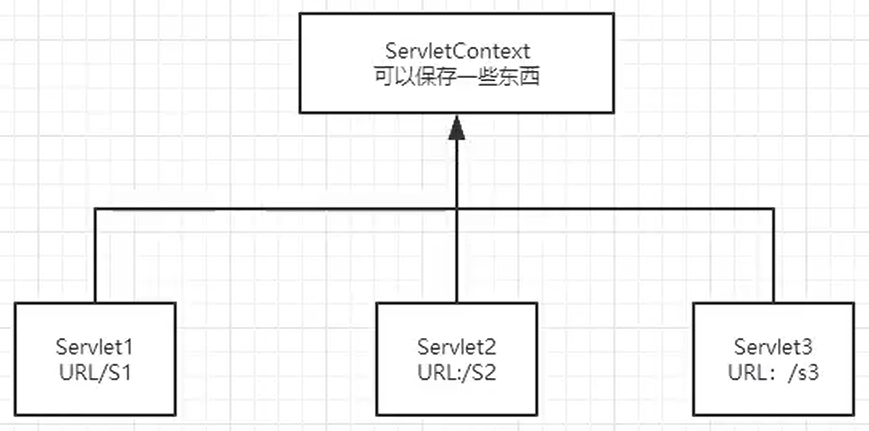

- 共享数据

  我在这个Servlet中保存的数据，可以在另一个Servlet中拿到

  ```java
  // 放置数据
  protected void doGet(HttpServletRequest req, HttpServletResponse resp) throws ServletException, IOException {
      //this.getInitParameter(); 初始化参数
      //this.getServletConfig(); Servlet配置
      //this.getServletContext(); Servlet上下文
      ServletContext context = this.getServletContext();
  
      String username = "sun1f";
      // 将一个数据保存在了ServletContext中，名字为username，值为username
      context.setAttribute("username", username);
  }
  ```

  ```java
  // 读取数据
  protected void doGet(HttpServletRequest req, HttpServletResponse resp) throws ServletException, IOException {
      ServletContext context = this.getServletContext();
      String username = (String) context.getAttribute("username");
  
      resp.setContentType("text/html");
      resp.setCharacterEncoding("utf-8");
      resp.getWriter().print("用户名是: " + username);
  }
  ```

  ```xml
  <!--配置web.xml-->
  <servlet>
      <servlet-name>hello</servlet-name>
      <servlet-class>com.sun1f.servlet.HelloServlet</servlet-class>
  </servlet>
  <servlet-mapping>
      <servlet-name>hello</servlet-name>
      <url-pattern>/hello</url-pattern>
  </servlet-mapping>
  
  <servlet>
      <servlet-name>getContext</servlet-name>
      <servlet-class>com.sun1f.servlet.GetServlet</servlet-class>
  </servlet>
  <servlet-mapping>
      <servlet-name>getContext</servlet-name>
      <url-pattern>/getContext</url-pattern>
  </servlet-mapping>
  ```

- 获取初始化参数

  ```xml
  <!--在web.xml中，配置一些web应用的初始化参数-->
  <context-param>
      <param-name>url</param-name>
      <param-value>jdbc:mysql://localhost:3306/mybatis</param-value>
  </context-param>
  ```

  ```java
  // 获取初始化参数
  protected void doGet(HttpServletRequest req, HttpServletResponse resp) throws ServletException, IOException {
      ServletContext context = this.getServletContext();
      String url = context.getInitParameter("url");
      resp.getWriter().print(url);
  }
  ```

- 请求转发（URL不变）

  ```java
  protected void doGet(HttpServletRequest req, HttpServletResponse resp) throws ServletException, IOException {
      ServletContext context = this.getServletContext();
      System.out.println("进入了ServletDemo4...");
      // RequestDispatcher requestDispatcher = context.getRequestDispatcher("/demo3"); 转发的请求路径
      // requestDispatcher.forward(req, resp); 调用forward方法实现请求转发
      context.getRequestDispatcher("/demo3").forward(req, resp);
  }
  ```

  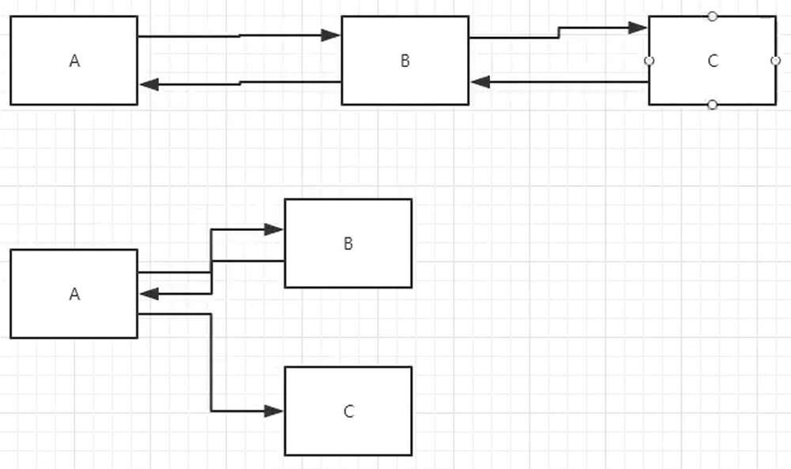

- 读取资源文件：文件流

  Properties

  - 在java目录下新建properties
  - 在resources目录下新建properties

  发现，Tomcat启动后，properties都被打包到了同一路径classes下（target目录中），我们俗称这个路径为classpath

  ```properties
  # 添加资源文件 db.properties
  username = root
  password = 123456
  ```

  ```java
  // 读取资源文件 并打印
  protected void doGet(HttpServletRequest req, HttpServletResponse resp) throws ServletException, IOException {
      InputStream is = this.getServletContext().getResourceAsStream("/WEB-INF/classes/db.properties");
  
      Properties prop = new Properties();
      prop.load(is);
      String user = prop.getProperty("username");
      String pwd = prop.getProperty("password");
  
      resp.getWriter().print(user + ": " + pwd);
  }
  ```

  

### 6.6 HttpServletRequest与HttpServletResponse

web服务器接收到客户端的http请求，针对这个请求，分别创建一个代表请求的HttpServletRequest对象，和代表响应的HttpServletResponse对象。

- 如果要获取客户端请求过来的参数：找HttpServletRequest
- 如果要给客户端响应一些信息，找HttpServletResponse

#### 6.6.1 HttpServletResponse

##### 简单分类

1. 负责向浏览器发送数据的方法

   ```java
   ServletOutputStream getOutputStream() throws IOException;
   
   PrintWriter getWriter() throws IOException;
   ```

2. 负责向浏览器发送响应头的方法

   ```java
   // ServletResponse 类中的方法
   void setCharacterEncoding(String var1);
   
   void setContentLength(int var1);
   
   void setContentLengthLong(long var1);
   
   void setContentType(String var1);
   
   void setBufferSize(int var1);
   ```

   ```java
   // HttpServletResponse (extends ServletResponse) 中的方法
   void setDateHeader(String var1, long var2);
   
   void addDateHeader(String var1, long var2);
   
   void setHeader(String var1, String var2);
   
   void addHeader(String var1, String var2);
   
   void setIntHeader(String var1, int var2);
   
   void addIntHeader(String var1, int var2);
   ```

3. 响应状态码常量

   ```java
   int SC_CONTINUE = 100;
   int SC_SWITCHING_PROTOCOLS = 101;
   int SC_OK = 200;
   int SC_CREATED = 201;
   int SC_ACCEPTED = 202;
   int SC_NON_AUTHORITATIVE_INFORMATION = 203;
   int SC_NO_CONTENT = 204;
   int SC_RESET_CONTENT = 205;
   int SC_PARTIAL_CONTENT = 206;
   int SC_MULTIPLE_CHOICES = 300;
   int SC_MOVED_PERMANENTLY = 301;
   int SC_MOVED_TEMPORARILY = 302;
   int SC_FOUND = 302;
   int SC_SEE_OTHER = 303;
   int SC_NOT_MODIFIED = 304;
   int SC_USE_PROXY = 305;
   int SC_TEMPORARY_REDIRECT = 307;
   int SC_BAD_REQUEST = 400;
   int SC_UNAUTHORIZED = 401;
   int SC_PAYMENT_REQUIRED = 402;
   int SC_FORBIDDEN = 403;
   int SC_NOT_FOUND = 404;
   int SC_METHOD_NOT_ALLOWED = 405;
   int SC_NOT_ACCEPTABLE = 406;
   int SC_PROXY_AUTHENTICATION_REQUIRED = 407;
   int SC_REQUEST_TIMEOUT = 408;
   int SC_CONFLICT = 409;
   int SC_GONE = 410;
   int SC_LENGTH_REQUIRED = 411;
   int SC_PRECONDITION_FAILED = 412;
   int SC_REQUEST_ENTITY_TOO_LARGE = 413;
   int SC_REQUEST_URI_TOO_LONG = 414;
   int SC_UNSUPPORTED_MEDIA_TYPE = 415;
   int SC_REQUESTED_RANGE_NOT_SATISFIABLE = 416;
   int SC_EXPECTATION_FAILED = 417;
   int SC_INTERNAL_SERVER_ERROR = 500;
   int SC_NOT_IMPLEMENTED = 501;
   int SC_BAD_GATEWAY = 502;
   int SC_SERVICE_UNAVAILABLE = 503;
   int SC_GATEWAY_TIMEOUT = 504;
   int SC_HTTP_VERSION_NOT_SUPPORTED = 505;
   ```

##### 常见应用

- 向浏览器输出消息（如getwriter，outstream)

- 下载文件

  - 获取下载文件的路径

  - 获取下载文件的名称

  - 设置想办法让浏览器能够支持下载我们需要的东西

  - 获取下载文件的输入流

  - 创建缓冲区

  - 获取OutStream对象

  - 将FileInputStream流写入到buffer缓冲区

  - 使用OutStream将缓冲区中的数据输出到客户端

    ```java
    // 文件下载
    protected void doGet(HttpServletRequest req, HttpServletResponse resp) throws ServletException, IOException {
        //- 获取下载文件的路径
        String realpath = "F:\\yaner\\programming\\learning\\JavaWeb\\javaweb-02-servlet\\response\\target\\classes\\头像.jpg";
        System.out.println("下载文件的路径为: " + realpath);
        //- 获取下载文件的名称 （一般最后一个 / 后面的字符串就是文件名）
        String filename = realpath.substring(realpath.lastIndexOf("\\") + 1);
        //- 设置想办法让浏览器能够支持下载我们需要的东西
        // 下面是下载的固定写法，对于中文文件名，通过URLEncoder.encode编码，否则可能乱码
        // resp.setHeader("Content-Disposition", "attachment;filename=" + filename);
        resp.setHeader("Content-Disposition", "attachment;filename=" + URLEncoder.encode(filename, "UTF-8"));
        //- 获取下载文件的输入流
        FileInputStream fin = new FileInputStream(realpath);
        //- 创建缓冲区
        int len = 0;
        byte[] buffer = new byte[1024];
        //- 获取OutStream对象
        ServletOutputStream sout = resp.getOutputStream();
        //- 将FileInputStream流写入到buffer缓冲区
        //- 使用OutStream将缓冲区中的数据输出到客户端
        while((len = fin.read(buffer)) > 0) {
            sout.write(buffer, 0, len);
        }
        fin.close();
        sout.close();
    }
    ```

- 验证码功能

  ```java
  protected void doGet(HttpServletRequest req, HttpServletResponse resp) throws ServletException, IOException {
      // 让浏览器3秒自动刷新一次
      resp.setHeader("refresh", "3");
  
      // 在内存中创建一个图片
      BufferedImage image = new BufferedImage(80, 20, BufferedImage.TYPE_INT_RGB);
  
      // 得到图片
      // g 相当于一支笔
      Graphics2D g = (Graphics2D) image.getGraphics();
  
      // 设置图片背景颜色
      g.setBackground(Color.white);
      g.fillRect(0, 0, 80, 20);
  
      // 给图片写数据
      g.setColor(Color.blue);
      g.setFont(new Font(null, Font.BOLD, 20));
      g.drawString(makeNum(), 0, 20);
  
      // 重点！告诉浏览器，这个请求用图片的方式打开
      resp.setContentType("image/jpeg");
  
      // 设置过期的时限
      resp.setDateHeader("expires", -1);
  
      // 网站存在缓存，设置不让浏览器缓存
      resp.setHeader("Cache-Control", "no-cache");
      resp.setHeader("Pragma", "no-cache");
  
      // 把图片写给浏览器
      ImageIO.write(image, "jpg", resp.getOutputStream());
  }
  
  private String makeNum() {
      // 获取一个7位随机数
      Random random = new Random();
      String num = random.nextInt(9999999) + "";
      StringBuffer sb = new StringBuffer();
      for(int i = 0; i < 7 - num.length(); ++i) {
          sb.append("0");
      }
      num = sb.toString() + num;
      return num;
  }
  ```

- ==实现重定向（重点）==

  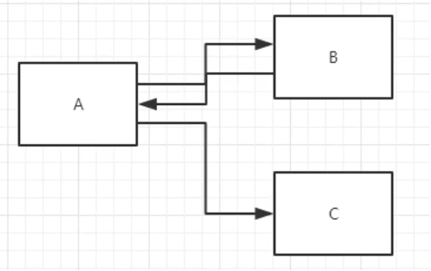

一个web资源（B）收到客户端（A）请求后，它通知客户端去访问另一个web资源（C），这个过程叫重定向

```java
void sendRedirect(String var1) throws IOException;
```

```java
protected void doGet(HttpServletRequest req, HttpServletResponse resp) throws ServletException, IOException {
    //resp.setHeader("Location", "response_war/image");
    //resp.setStatus(302); 设置状态码
    
    resp.sendRedirect("/response_war/image"); // 相当于上面拆分的两步
}
```

常见面试题

1. 重定向和转发的区别
   - 请求转发的时候，URL不会产生变化
   - 重定向的时候，URL会产生变化

示例：表单登录页面 + 重定向跳转

```java
// RequestTest.java
protected void doGet(HttpServletRequest req, HttpServletResponse resp) throws ServletException, IOException {
    System.out.println("进入了这个请求...");
    // 处理请求
     String username = req.getParameter("username");
     String password = req.getParameter("password");

    System.out.println("username = " + username + ", password = " + password);

    // 重定向一定要注意路径问题！否则404
    resp.sendRedirect("/response_war/success.jsp");
}
```

```jsp
<%--success.jsp--%>
<%@ page contentType="text/html;charset=UTF-8" language="java" %>
<html>
<head>
    <title>Success</title>
</head>
<body>
<h1>
    Success
</h1>
</body>
</html>
```

```xml
<!--web.xml-->
<servlet>
  <servlet-name>request</servlet-name>
  <servlet-class>com.sun1f.servlet.RequestTest</servlet-class>
</servlet>
<servlet-mapping>
  <servlet-name>request</servlet-name>
  <url-pattern>/login</url-pattern>
</servlet-mapping>
```

#### 6.6.2 HttpServletRequest

HttpServletRequest代表客户端的请求，用户通过Http协议访问服务器，HTTP请求中的所有信息会被封装到HttpServletRequest，通过这个HttpServletRequest方法，获取客户端的所有信息

**获取参数，请求转发**

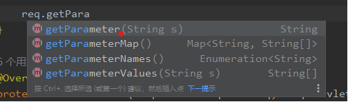

```xml
<%--index.jsp--%>
<%@ page contentType="text/html;charset=UTF-8" language="java" %>
<html>
<head>
    <title>登录</title>
</head>
<body>

<h1>Login</h1>

<div style="text-align: center">
    <%--以post的方式提交到login请求--%>
    <form action="${pageContext.request.contextPath}/login" method="post">
        username: <input type="text" name="username"> <br>
        password: <input type="password" name="password"> <br>
        hobby:
        <input type="checkbox" name="hobby" value="girl"> girl
        <input type="checkbox" name="hobby" value="code"> code
        <input type="checkbox" name="hobby" value="singing"> singing
        <input type="checkbox" name="hobby" value="movie"> movie
        <br>
        <input type="submit">
    </form>
</div>

</body>
</html>
            
```

```java
// LoginServlet.java
protected void doGet(HttpServletRequest req, HttpServletResponse resp) throws ServletException, IOException {
    String username = req.getParameter("username");
    String password = req.getParameter("password");
    String[] hobby = req.getParameterValues("hobby");
    System.out.println("===========================");
    System.out.println(username);
    System.out.println(password);
    System.out.println(Arrays.toString(hobby));
    System.out.println("===========================");

    // 通过请求转发(不改变URL)，这里的"/"代表当前web应用
    req.getRequestDispatcher("/success.jsp").forward(req, resp);
}
```

## 7. Cookie和Session

### 7.1 会话

**会话：**用户打开一个浏览器，点击了很多超链接，访问了多个web资源，关闭浏览器，这个过程称之为会话。

- 有状态会话：一个同学来过教室，下次再来教室，我们会知道这个同学曾经来过，称之为有状态会话

  一个网站，怎么证明你来过？

  客户端   服务端

  1. 服务端给客户端一个信件，客户端下次访问服务端时带着 ==cookie==
  2. 服务端登记你来过了，下次你来的时候直接匹配你 ==session==

- 保存会话的两种技术

  cookie：客户端技术（响应，请求）

  session：服务端技术，利用这个技术，可以保存用户的会话信息。我们可以把信息或者数据放在session中

### 7.2 Cookie

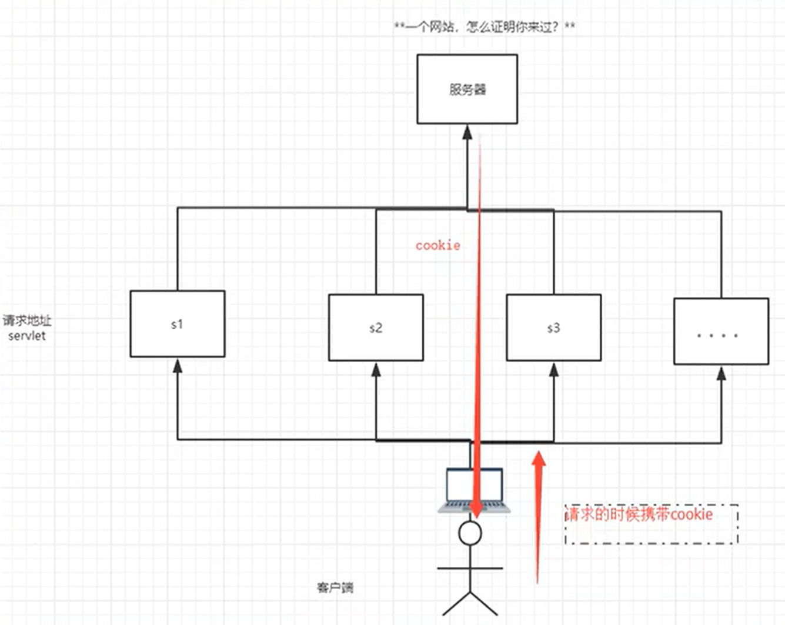

1. 从请求中拿到cookie信息
2. 服务器响应给客户端cookie

```java
Cookie[] cookies = req.getCookies(); // 获取cookie
cookie.getName(); // 获取cookie中的key
cookie.getValue(); // 获取cookie中的value
Cookie cookie = new Cookie("lastLoginTime", System.currentTimeMillis() + ""); // 新建一个cookie
cookie.setMaxAge(24 * 60 * 60); // 设置cookie的有效期（换算成秒）
resp.addCookie(cookie); // 响应给客户端一个cookie
```

**cookie：一般会保存在本地的用户目录下的Appdata中**


**一个网站cookie是否存在上限？（细节问题）**

- 一个cookie还能保存一个信息
- 一个web站点可以给浏览器发送多个cookie，最多存放20个cookie
- cookie大小有限制，大约4kb
- 浏览器存放cookie的上限约300个


**删除cookie的方法：**

- 不设置有效期，关闭浏览器后，自动失效
- 设置有效期时间为0

### 7.3 Session（重点）

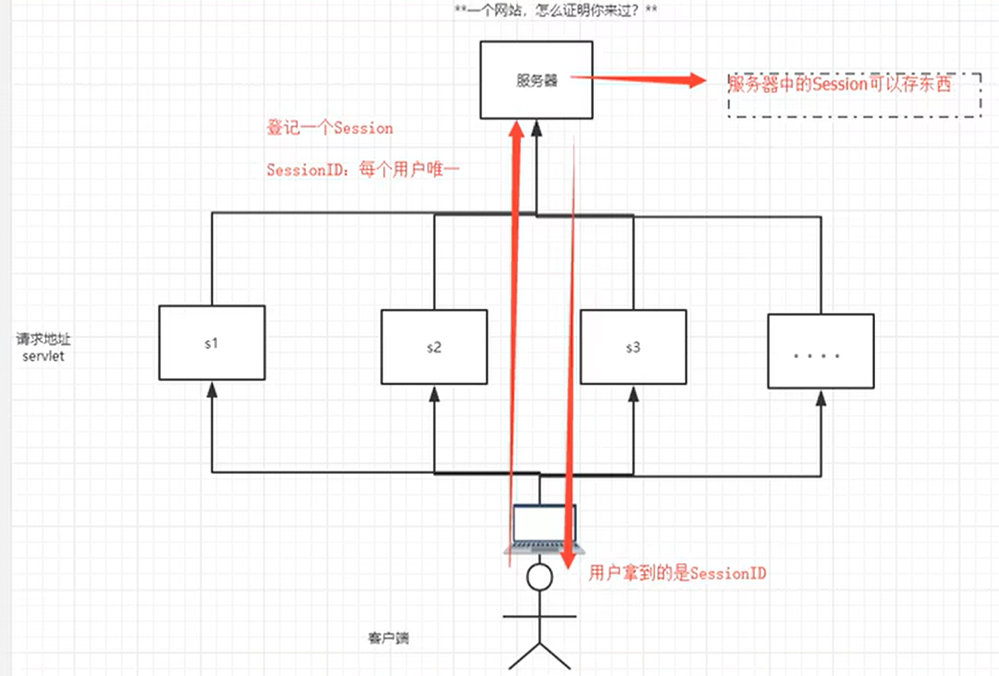

什么是Session：

- 服务器会给每一个用户（浏览器）创建一个Session对象
- 一个Session独占一个浏览器，只要浏览器没有关闭，这个Session就存在
- 用户登录之后，整个网站它都可以访问 ---> 保存用户信息；保存购物车信息...

Session和Cookie的区别：

- Cookie是把用户的数据写给用户的浏览器，浏览器保存（可以保存多个）
- Session把用户的数据写到用户独占的Session中，服务器保存（保存重要的信息，减少服务器资源的浪费）
- Session对象有服务器创建

Session的使用场景：

- 保存一个登录用户的信息
- 购物车信息
- 在整个网站中经常会使用的数据，我们将它保存在Session中

使用Session：

```java
protected void doGet(HttpServletRequest req, HttpServletResponse resp) throws ServletException, IOException {
    // 解决乱码
    req.setCharacterEncoding("UTF-8");
    resp.setCharacterEncoding("UTF-8");
    resp.setContentType("text/html;charset=utf-8");

    // 得到Session
    HttpSession session = req.getSession();

    // 给Session中存东西(Person对象)
    session.setAttribute("name", new Person("sun2f", 1));

    // 获取Session的ID
    String sessionId = session.getId();

    // 判断Session是不是新创建
    if(session.isNew()) {
        resp.getWriter().write("session创建成功，ID: " + sessionId);
    } else {
        resp.getWriter().write("session已经在服务器中存在了，ID: " + sessionId);
    }


    // Session创建的时候做了什么事情
    // Cookie cookie = new Cookie("JSESSIONID", sessionId);
    // resp.addCookie(cookie);
}
```

```java
protected void doGet(HttpServletRequest req, HttpServletResponse resp) throws ServletException, IOException {
    // 解决乱码
    req.setCharacterEncoding("UTF-8");
    resp.setCharacterEncoding("UTF-8");
    resp.setContentType("text/html;charset=utf-8");

    // 得到Session
    HttpSession session = req.getSession();

    // 从Session中取东西(Person对象)
    Person person = (Person) session.getAttribute("name");


    System.out.println(person.toString());
}
```

```java
protected void doGet(HttpServletRequest req, HttpServletResponse resp) throws ServletException, IOException {
    HttpSession session = req.getSession();
    // 删除键
    session.removeAttribute("name");
    // 手动注销session（sessionid就没了），也可以在web.xml中注销
    session.invalidate();
}
```

**Session自动过期，还可以再web.xml中配置`session-config`：**

```xml
<!--设置session默认的自动失效时间-->
<session-config>
    <!--15分钟后session自动失效（以分钟为单位）-->
    <session-timeout>15</session-timeout>
</session-config>
```

**Cookie、Session与ServletContext的特点：**


***ServletContext"大家都能访问到"***

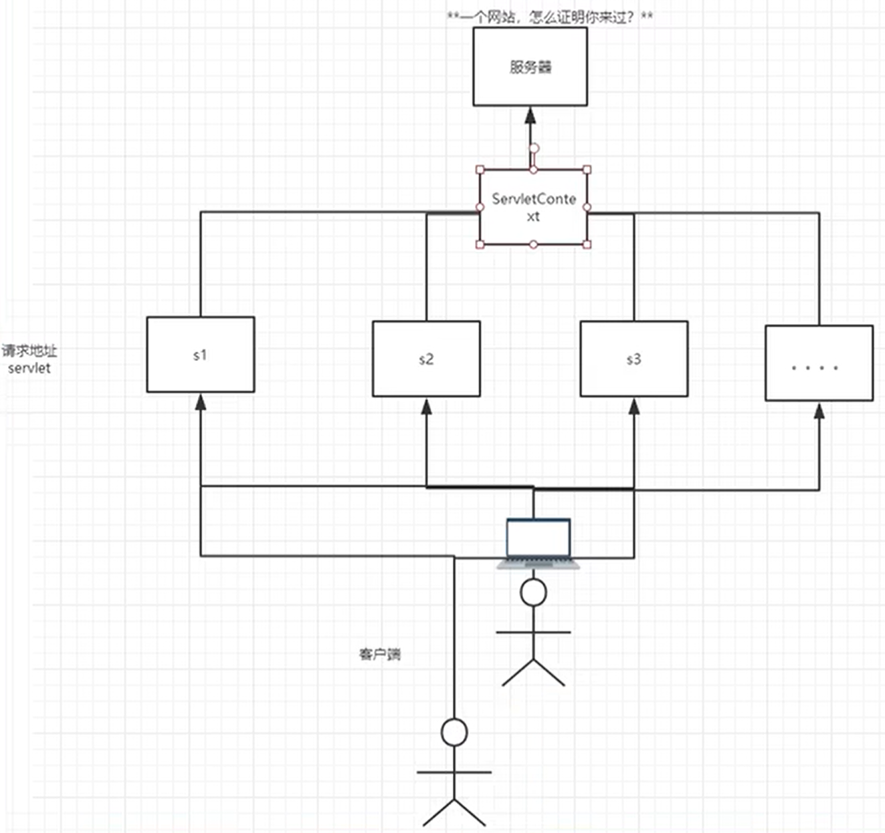

## 8. JSP

什么是JSP？

Java Server Pages：Java服务器端页面，也和Servlet一样，用于动态web技术

最大的特点：

- 写JSP就像在写HTML
- 区别：
  - HTML只给用户提供静态的数据
  - JSP页面中可以嵌入Java代码，为用户提供动态数据

### 8.1 JSP原理

**JSP原理图：**

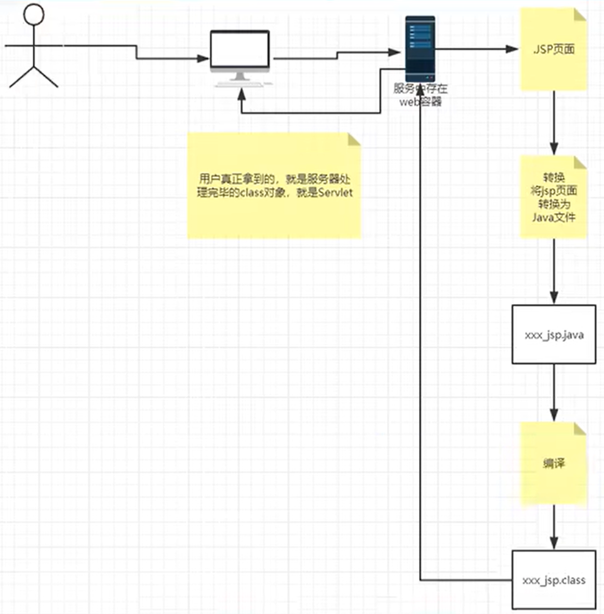

思路：JSP到底怎么执行的

- 代码层面
- 服务器内部工作
  - Tomcat中有一个work目录
  - IDEA中使用Tomcat的会在IDEA的Tomcat中产生一个work目录

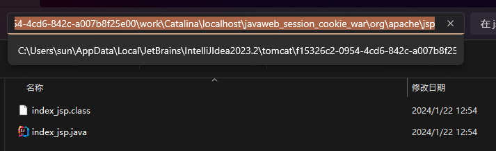

**浏览器像服务器发送请求，不管访问什么资源，其实都是在访问Servlet**

JSP最终也会被转换成为一个Java类

**JSP本质上就是一个Servlet**

```java
// 初始化
public void _jspInit() {
}

// 销毁
public void _jspDestroy() {
}

// 服务
public void _jspService(final javax.servlet.http.HttpServletRequest request, final javax.servlet.http.HttpServletResponse response)throws java.io.IOException, javax.servlet.ServletException {
    // ...
}
```

**_jspService函数：**

1. 判断请求

2. 内置一些对象

   ```java
   final javax.servlet.jsp.PageContext pageContext;
   javax.servlet.http.HttpSession session = null;
   final javax.servlet.ServletContext application; // applicationContext
   final javax.servlet.ServletConfig config;
   javax.servlet.jsp.JspWriter out = null;
   final java.lang.Object page = this; // page: 当前
   javax.servlet.jsp.JspWriter _jspx_out = null;
   javax.servlet.jsp.PageContext _jspx_page_context = null;
   ```

3. 输出页面前增加的代码

   ```java
   response.setContentType("text/html"); // 设置相应的页面类型
   pageContext = _jspxFactory.getPageContext(this, request, response,
   			null, true, 8192, true);
   _jspx_page_context = pageContext;
   application = pageContext.getServletContext();
   config = pageContext.getServletConfig();
   session = pageContext.getSession();
   out = pageContext.getOut();
   _jspx_out = out;
   ```

4. 以上这些对象我们直接在JSP页面中使用

在JSP页面中，

- 只要是Java代码就会原封不动的输出

- 如果是HTML代码，就会被转换下面这样的格式输出到前端

  ```java
  out.write("<html>\r\n")
  ```

  

### 8.2 JSP基础语法

JSP作为Java技术的一种应用，它支持所有的Java语法，并拥有一些自己扩充的语法。

**JSP表达式**

```jsp
<%--JSP表达式
语法：<%=变量或者表达式%>
作用：用来将程序输出到客户端
--%>
<%= new java.util.Date()%>
```

**JSP脚本片段**


